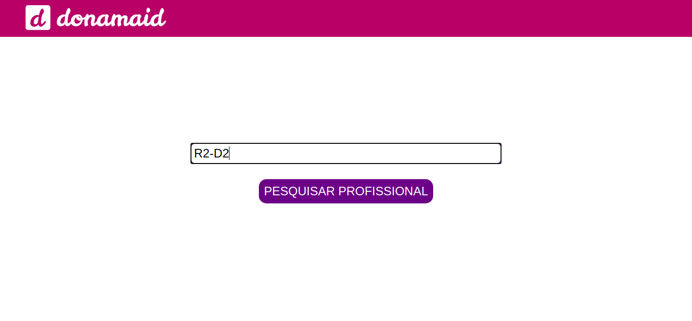
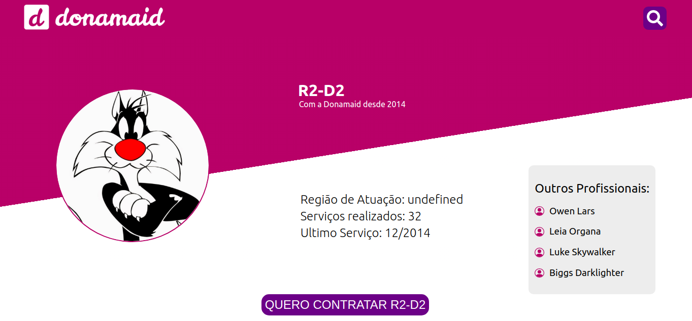
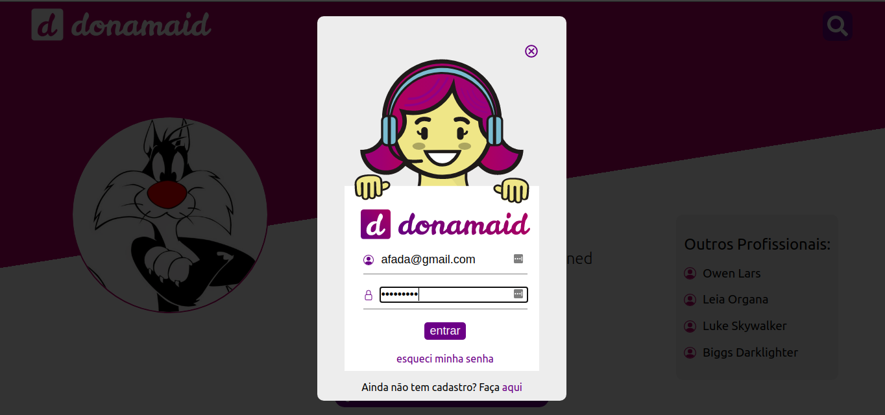
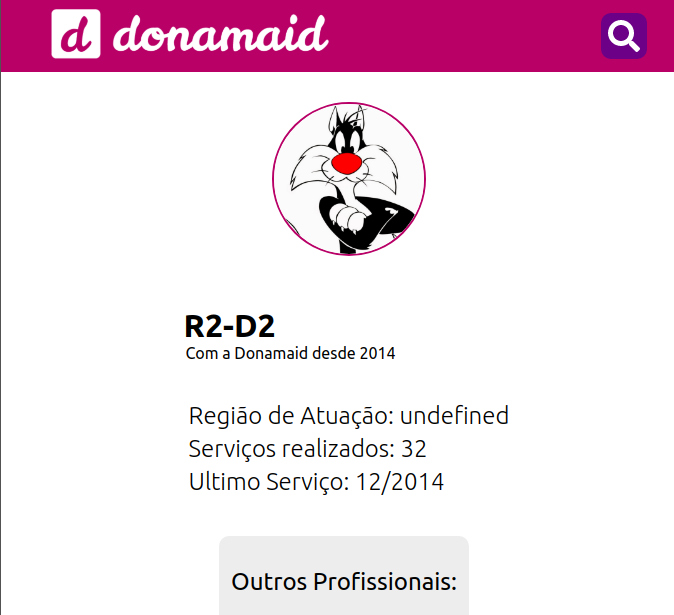
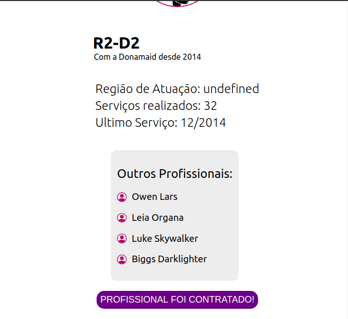

# Teste frontend

**Importante:** leia todo o documento com atenção.

**Descrição:** transformar o layout fornecido em código e consumir a API [SWAPI - The Star Wars API](https://swapi.dev/) como base de dados. 
O layout deve ser igual ao fornecido. Porém, o layout para a listagem de outros profissionais fica a seu critério.
A imagem do perfil a ser exibida fica a sua escolha. Utilize as informações sobre o personagem para montar a descrição. Seja criativo!
Foco no UI: ao clicar em outro profissional devo ver a tela com as informações sobre ele. 
Esse repositório deve ser forkado para desenvolvimento do teste pelo candidato e ao final deve ser hospedado no Netlify.

**Endereço para o front no Netlify:**
    ([Solução Antonio Lisbôa](https://eager-turing-90e88a.netlify.app/))

# Telas do layout:

Os arquivos do layout estão dentro da pasta Assets/layout ou via [Adobe XD](https://xd.adobe.com/view/08c006f2-ade5-4c43-b48b-fa5f95050432-5d93/)

# Elementos do layout:

Todos os elementos de imagem para compor o layout se encontram na pasta Assets

# Requisitos:

- Atenção na sintaxe correspondente a semântica no HTML
- Organização e estrutura do código

Nossa stack é VueJS. Porém, não é necessário realizar o teste nesse framework, fique à vontade. 
Prezamos pelo conhecimento e sabemos que linguagens são ferramentas que podem ser aprendidas.

# Tecnologias Utilizadas:

O projeto foi desenvolvido utilizando JavaScript junto ao ReactJS. A biblioteca React Router Dom foi utilizado para criar as rotas do projeto e a biblioteca Axios para realizar a consulta a [SWAPI - The Star Wars API](https://swapi.dev/).

# Exemplo de Uso:

Inicialmente o usuário verá a página de pesquisar por um profissional, onde o mesmo pode pesquisar por algum nome presente na SWAPI (se você não estiver muito familiarizado com o universo Star Wars, sugiro pesquisar por R2-D2).

Ao clicar em **pesquisar profissional** o usuário será redirecionado para o perfil desse profissional.

O mesmo pode clicar em **contratar o profissional** escolhido ou clicar em uma das sugestões de profissionais na lista de outros profissionais. Caso o usuário deseje voltar para a página de busca, poderá clicar na lupa de pesquisa ou na logo donamaid.

Quando o usuário clicar em **contratar profissional**, será pedido o seu login e senha, onde só será permitido clicar em **entrar** quando o usuário preencher os campos email (o email é validado quando contêm um @) e senha.  

Ao clicar em **entrar** com os campos devidamente preenchidos, o botão **contratar profissional** terá seu texto mudado para _profissional foi contratado_, e se o usuário clicar no mesmo será redirecionado para a página de busca por um profissional.

O projeto foi todo desenvolvido de forma responsiva para atender aos layouts repassados pela equipe donamaid. Algumas funcionalidades foram adicionadas para melhorar a usabilidade da aplicação.

